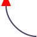

# @svag/lib

[](https://npmjs.org/package/@svag/lib)

`@svag/lib` is a library for drawing SVGs with common methods. It is used in other `svag` packages, e.g., [`@svag/terminal`](https://github.com/svagjs/terminal)

```sh
yarn add -E @svag/lib
```

## Table Of Contents

- [Table Of Contents](#table-of-contents)
- [Types](#types)
  * [`Coordinate`](#coordinate)
  * [`length`](#length)
  * [`percentage`](#percentage)
- [API](#api)
  * [`makeElement(name: string, options?: MakeElementOptions): string`](#makeelementname-stringoptions-makeelementoptions-string)
    * [`MakeElementOptions`](#makeelementoptions)
  * [`minify(svg: string): string`](#minifysvg-string-string)
  * [`roundedCorner(from: Coordinate, to: Coordinate, anticlockwise?: boolean): string`](#roundedcornerfrom-coordinateto-coordinateanticlockwise-boolean-string)
    * [Clockwise](#clockwise)
    * [Anticlockwise](#anticlockwise)
- [Elements](#elements)
  * [`svg(options: SVGOption): string`](#svgoptions-svgoption-string)
    * [`SVGOptions`](#svgoptions)
  * [`rect(attributes: RectAttributes): string`](#rectattributes-rectattributes-string)
    * [`RectAttributes`](#rectattributes)
- [TODO](#todo)
- [Copyright](#copyright)

## Types

There are some common types used by various methods. They are described in this section.

__<a name="coordinate">`Coordinate`</a>__: A coordinate used for drawing.

| Name | Type | Description | Default |
| ---- | ---- | ----------- | ------- |
| __x*__ | _number_ | The `x` position of the coordinate. | - |
| __y*__ | _number_ | The `y` position of the coordinate. | - |

`string|number` __<a name="length">`length`</a>__: A length is a distance measurement, given as a number along with a unit.

`string` __<a name="percentage">`percentage`</a>__: Percentages are specified as a number followed by a `%` character.

## API

The package library exports a number of functions, including `makeElement` and `minify`.

```js
import { makeElement, minify } from '@svag/lib'
```

### `makeElement(`<br/>&nbsp;&nbsp;`name: string,`<br/>&nbsp;&nbsp;`options?: MakeElementOptions,`<br/>`): string`

This function will create an element as a string given its name and the options. The attributes will be split by new lines whenever the line width reaches the length of 100 symbols, and each line of the content will be indented by 2 spaces as well.

__<a name="makeelementoptions">`MakeElementOptions`</a>__: Options to make a new element.

| Name | Type | Description | Default |
| ---- | ---- | ----------- | ------- |
| content | _string\|string[]_ | The content to write inside of the element, such as string or an array of strings. | - |
| attributes | _object_ | A map of attributes to add to the element. | - |

```js
import { makeElement } from '@svag/lib'

const circle = makeElement('circle', {
  attributes: {
    cx: 50,
    cy: 50,
    r: 25,
  },
})
const rect = makeElement('rect', {
  attributes: {
    width: '100',
    height: '100',
  },
})
const g = makeElement('g', {
  attributes: {
    fill: 'green',
  },
  // 1. SET Single content attribute
  content: rect,
})
const element = makeElement('g', {
  name: 'g',
  attributes: {
    test: true,
    'font-size': '12px',
  },
  // 2. SET Multiple content attributes
  content: [circle, g],
})
```

```svg
<g test="true" font-size="12px">
  <circle cx="50" cy="50" r="25"/>
  <g fill="green">
    <rect width="100" height="100"/>
  </g>
</g>
```

### `minify(`<br/>&nbsp;&nbsp;`svg: string,`<br/>`): string`

Removes the whitespace between the elements in the input string.

```js
import { minify } from '@svag/lib'

const svg = `
<g>
  <circle fill="#FF5F52" cx="5" cy="5" r="5.25"/>
  <circle stroke="#E33E32" stroke-width="1" cx="5" cy="5" r="5.5"/>
</g>
<g>
  <circle fill="#FFBE05" cx="25" cy="5" r="5.25"/>
  <circle stroke="#E2A100" stroke-width="1" cx="25" cy="5" r="5.5"/>
</g>
<g>
  <circle fill="#15CC35" cx="45" cy="5" r="5.25"/>
  <circle stroke="#17B230" stroke-width="1" cx="45" cy="5" r="5.5"/>
</g>
`

const minified = minify(svg)
```

```svg
<g><circle fill="#FF5F52" cx="5" cy="5" r="5.25"/><circle stroke="#E33E32" stroke-width="1" cx="5" cy="5" r="5.5"/></g><g><circle fill="#FFBE05" cx="25" cy="5" r="5.25"/><circle stroke="#E2A100" stroke-width="1" cx="25" cy="5" r="5.5"/></g><g><circle fill="#15CC35" cx="45" cy="5" r="5.25"/><circle stroke="#17B230" stroke-width="1" cx="45" cy="5" r="5.5"/></g>
```

### `roundedCorner(`<br/>&nbsp;&nbsp;`from: Coordinate,`<br/>&nbsp;&nbsp;`to: Coordinate,`<br/>&nbsp;&nbsp;`anticlockwise?: boolean,`<br/>`): string`

Create a `C` directive to include in a `path` element to create a rounded corner. If `anticlockwise` argument is passed, the path will follow the counter-clockwise movement.

<a name="clockwise">Clockwise</a>: The table below shows the corners drawn clockwise.

<table>
 <thead>
  <tr>
   <th>Direction</th>
   <th>Usage</th>
   <th>Output</th>
   <th>Preview</th>
  </tr>
 </thead>
 <tbody>
  <tr>
   <td>Top Right</td>
   <td>

```js
import { roundedCorner } from '@svag/lib'
const C = roundedCorner({
  x: 0,
  y: 1,
}, {
  x: 50,
  y: 51,
})
```
  </td>
   <td>

```svg
C 25 1, 50 26, 50 51
```
  </td>
   <td>


</td>
  </tr>
  <tr>
   <td>Bottom Right</td>
   <td>

```js
import { roundedCorner } from '@svag/lib'

const C = roundedCorner({
  x: 60,
  y: 0,
}, {
  x: 10,
  y: 50,
})
```
   </td>
   <td>

```svg
C 60 25, 35 50, 10 50
```
  </td>
   <td>


</td>
  </tr>
  <tr>
   <td>Bottom Left</td>
   <td>

```js
import { roundedCorner } from '@svag/lib'

const C = roundedCorner({
  x: 60,
  y: 60,
}, {
  x: 10,
  y: 10,
})
```
   </td>
   <td>

```svg
C 35 60, 10 35, 10 10
```
</td>
   <td>


</td>
  </tr>
  <tr>
   <td>Top Left</td>
   <td>

```js
import { roundedCorner } from '@svag/lib'

const C = roundedCorner({
  x: 1,
  y: 60,
}, {
  x: 51,
  y: 10,
})
```
   </td>
   <td>

```svg
C 1 35, 26 10, 51 10
```
</td>
   <td>


</td>
  </tr>
 </tbody>
</table>

<a name="anticlockwise">Anticlockwise</a>: The table below shows the corners drawn anticlockwise.

<table>
 <thead>
  <tr>
   <th>Direction</th>
   <th>Usage</th>
   <th>Output</th>
   <th>Preview</th>
  </tr>
 </thead>
 <tbody>
  <tr>
   <td>Top Right</td>
   <td>

```js
import { roundedCorner } from '@svag/lib'

const C = roundedCorner({
  x: 60,
  y: 60,
}, {
  x: 10,
  y: 10,
}, true)
```
  </td>
   <td>

```svg
C 60 35, 35 10, 10 10
```
  </td>
   <td>


</td>
  </tr>
  <tr>
   <td>Top Left</td>
   <td>

```js
import { roundedCorner } from '@svag/lib'

const C = roundedCorner({
  x: 60,
  y: 1,
}, {
  x: 10,
  y: 51,
}, true)
```
   </td>
   <td>

```svg
C 35 1, 10 26, 10 51
```
</td>
   <td>


</td>
  </tr>
  <tr>
   <td>Bottom Left</td>
   <td>

```js
import { roundedCorner } from '@svag/lib'
const C = roundedCorner({
  x: 1,
  y: 0,
}, {
  x: 51,
  y: 50,
}, true)
```
   </td>
   <td>

```svg
C 1 25, 26 50, 51 50
```
</td>
   <td>


</td>
  </tr>
  <tr>
   <td>Bottom Right</td>
   <td>

```js
import { roundedCorner } from '@svag/lib'

const C = roundedCorner({
  x: 1,
  y: 60,
}, {
  x: 51,
  y: 10,
}, true)
```
   </td>
   <td>

```svg
C 26 60, 51 35, 51 10
```
  </td>
   <td>


</td>
  </tr>
 </tbody>
</table>

## Elements

This section describes how to create individual elements.

### `svg(`<br/>&nbsp;&nbsp;`options: SVGOption,`<br/>`): string`

Generate an `svg` element with given content and dimensions.

__<a name="svgoptions">`SVGOptions`</a>__: An option for creating an svg.

| Name | Type | Description | Default |
| ---- | ---- | ----------- | ------- |
| __width*__ | _number_ | The width of the `svg`. | - |
| __height*__ | _number_ | The height of the `svg`. | - |
| __content*__ | _string_ | The content to put inside of the `svg`. | - |
| stretch | _boolean_ | Expand the `svg` to the width of the container by not setting `width` and `height` attributes. | `true` |

```js
import { svg } from '@svag/lib'

const stretchedSvg = svg({
  height: 100,
  width: 100,
  content: '<example />',
})
```

```svg
<svg version="1.1" xmlns="http://www.w3.org/2000/svg" xmlns:xlink="http://www.w3.org/1999/xlink"
     viewBox="0, 0, 100, 100">
  <example />
</svg>
```

To generate an `svg` which will not adjust its size to the viewport, the `stretch` option needs to be set to `false`.

```js
import { svg } from '@svag/lib'

const fixedSvg = svg({
  height: 100,
  width: 100,
  content: '<example />',
  stretch: false,
})
```

```svg
<svg version="1.1" xmlns="http://www.w3.org/2000/svg" xmlns:xlink="http://www.w3.org/1999/xlink"
     viewBox="0, 0, 100, 100" width="100px" height="100px">
  <example />
</svg>
```

### `rect(`<br/>&nbsp;&nbsp;`attributes: RectAttributes,`<br/>`): string`

Create a `<rect>` element.

__<a name="rectattributes">`RectAttributes`</a>__: Non-global attributes for the element.

| Name | Type | Description | Default |
| ---- | ---- | ----------- | ------- |
| x | _length\|percentage_ | This attribute determines the x coordinate of the rect. | `0` |
| y | _length\|percentage_ | This attribute determines the y coordinate of the rect. | `0` |
| width | _'auto'\|length\|percentage_ | This attribute determines the width of the rect. | `auto` |
| height | _'auto'\|length\|percentage_ | This attribute determines the height of the rect. | `auto` |
| rx | _'auto'\|length\|percentage_ | This attribute determines the horizontal corner radius of the rect. | `auto` |
| ry | _'auto'\|length\|percentage_ | This attribute determines the vertical corner radius of the rect. | `auto` |
| pathLength | _number_ | This attribute lets specify the total length for the path, in user units. | - |

```js
import { rect } from '@svag/lib'

const image = rect({
  height: 100,
  width: 100,
  rx: '0.5em',
  ry: '0.5em',
})
```

```svg
<rect height="100" width="100" rx="0.5em" ry="0.5em"/>
```

## TODO

- [ ] Create an alias for each SVG element, e.g., `circle`, _etc_.
- [ ] Update `documentary` to make sure that types are linked to their description.

## Copyright

Some of the element documentation, including `rect` was taken directly from [MDN](https://developer.mozilla.org/en-US/docs/).

(c) [SVaG][1] 2018

[1]: https://svag.co
