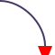

# @svag/lib

[](https://npmjs.org/package/@svag/lib)

`@svag/lib` is a library for drawing SVGs with common methods. It is used in other `svag` packages, e.g., [`@svag/terminal`](https://github.com/svagjs/terminal)

```sh
yarn add -E @svag/lib
```

## Table Of Contents

- [Table Of Contents](#table-of-contents)
- [API](#api)
  * [`makeElement(options: MakeElementOptions): string`](#makeelementoptions-makeelementoptions-string)
    * [`MakeElementOptions`](#makeelementoptions)
  * [`roundedCorner(from: Coordinate, to: Coordinate): string`](#roundedcornerfrom-coordinateto-coordinate-string)
    * [`Coordinate`](#coordinate)
- [Element](#element)
  * [`svg(from: Coordinate, to: Coordinate): string`](#svgfrom-coordinateto-coordinate-string)
- [TODO](#todo)
- [Copyright](#copyright)

## API

The package library exports a number of functions, including `makeElement` and `minify`.

```js
import { makeElement, minify } from '@svag/lib'
```

### `makeElement(`<br/>&nbsp;&nbsp;`options: MakeElementOptions,`<br/>`): string`

This function will create an element as a string given the options.

__<a name="makeelementoptions">`MakeElementOptions`</a>__: Options to make a new element.

| Name | Type | Description | Default |
| ---- | ---- | ----------- | ------- |
| __name*__ | _string_ | The name of the new element element. | - |
| content | _string_ | The content to write inside of the element. | - |
| attributes | _object_ | A map of attributes to add to the element. | - |

```js
import { makeElement } from '@svag/lib'

const circle = makeElement({
  name: 'circle',
  attributes: {
    cx: 50,
    cy: 50,
    r: 25,
  },
})
const element = makeElement({
  name: 'rect',
  attributes: {
    test: true,
    'font-size': '12px',
  },
  content: circle,
})

console.log(element)
```

```svg
<rect test="true" font-size="12px"><circle cx="50" cy="50" r="25"/></rect>
```

### `roundedCorner(`<br/>&nbsp;&nbsp;`from: Coordinate,`<br/>&nbsp;&nbsp;`to: Coordinate,`<br/>`): string`

Create a `C` directive to include in a `path` element to create a rounded corner.

__<a name="coordinate">`Coordinate`</a>__: A coordinate used for drawing.

| Name | Type | Description | Default |
| ---- | ---- | ----------- | ------- |
| __x*__ | _number_ | The `x` position of the coordinate. | - |
| __y*__ | _number_ | The `y` position of the coordinate. | - |

<table>
 <thead>
  <th>
   <td>Direction</td>
   <td>Output</td>
   <td>Preview</td>
  </th>
 </thead>
 <tbody>
  <tr>
   <td>Top Right</td>
   <td>

```svg
C 10 5, 5 10, 0 10
```
</td>
   <td>


</td>
  </tr>
 </tbody>
</table>
## Element

This section describes how to create individual elements.

### `svg(`<br/>&nbsp;&nbsp;`from: Coordinate,`<br/>&nbsp;&nbsp;`to: Coordinate,`<br/>`): string`

Generate an `svg` element with given content and dimensions.

```js
import { svg } from '../../src'

const stretchedSvg = svg({
  height: 100,
  width: 100,
  content: '<example />',
})

const fixedSvg = svg({
  height: 100,
  width: 100,
  content: '<example />',
  stretch: false,
})

console.log(stretchedSvg)
console.log('\n====\n')
console.log(fixedSvg)
```

```xml
<svg version="1.1" xmlns="http://www.w3.org/2000/svg" xmlns:xlink="http://www.w3.org/1999/xlink" viewBox="0, 0, 100, 100" width="100px" height="100px"><example /></svg>

====

<svg version="1.1" xmlns="http://www.w3.org/2000/svg" xmlns:xlink="http://www.w3.org/1999/xlink" viewBox="0, 0, 100, 100" width="100px" height="100px"><example /></svg>
```

## TODO

- [ ] Create an alias for each SVG element, e.g., `circle`, `rect`, _etc_.

## Copyright

(c) [SVaG][1] 2018

[1]: https://svag.co
